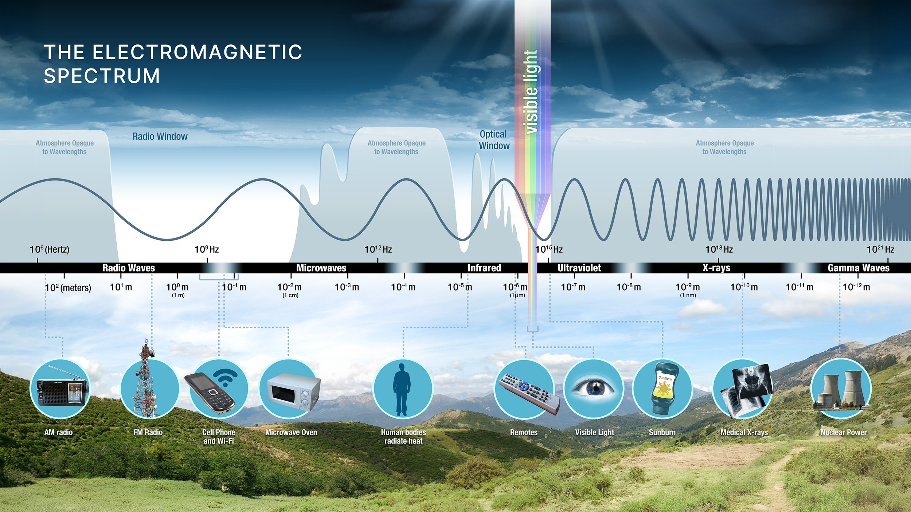

> *If the Sun’s Light consisted of but one sort of Rays, there would be but one Colour in the whole World. – Isaac Newton, Opticks (1704)*

# Remote Sensing Basics

::: callout-note
## Learning Objectives

Explain the role of electromagnetic energy in remote sensing.

Define key terms such as reflectance, atmospheric windows, and spectral signature.
:::

Remote sensing uses electromagnetic energy to measure properties of distance objects. The electromagnetic energy can either be ***reflected from*** or ***emitted by*** objects of interest. Many remote sensing systems rely on energy from the sun (the primary source of the energy observed by remote sensing system), which includes visible light as well as forms of energy we cannot see with our eyes. When sunlight reaches the Earth, the energy is being absorbed or reflected by different objects on the land surface. Sensors can then detect the reflected energy and energy emitted by target to investigate their characteristics.

To understand how remote sensing works, it is important to introduce the concept of ***wavelength***. In this case, let’s think light energy behaves as waves (the other “form” of light is particle), and wavelength refers to the distance between two consecutive repeating shapes of that wave, e.g., the distance between two consecutive peaks. The units of wavelengths are usually measured in extremely small units, such as micrometers (μm; 10^-6^m) and nanometers (nm; 10^-9^m). Remote sensing extends beyond the visible portion of the electromagnetic spectrum into regions such as the infrared and microwave @fig-spectrum.

{#fig-spectrum}

All materials on Earth interact with energy in different ways: they may reflect, absorb, or transmit it, and the proportions of each depend on the wavelength of that energy. Satellites or aircrafts carry instruments or sensors that measure electromagnetic radiation coming from the Earth-atmosphere system. These measurements are collected across specific portions of the electromagnetic spectrum called ***bands***, where each band represents a defined range of wavelengths @fig-landsatbands.

{#fig-landsatbands}

As solar energy travels through the atmosphere, it is reflected, absorbed, and scattered, leaving only a portion of the original energy to reach the Earth's surface @fig-energybudget. 

{#fig-energybudget}

As solar energy travels toward the Earth’s surface, it passes through the atmosphere, where it is modified in both amount and composition. Gases, aerosols, and water vapor absorb and scatter portions of this energy, and these effects vary depending on the wavelength @fig-solarradiation. As a result, some wavelengths pass through the atmosphere with little interference, while others are partially or completely blocked before reaching the ground. The ranges of wavelengths that can travel through the atmosphere relatively unimpeded are known as ***atmospheric windows***.

{#fig-solarradiation}

One phenomenon is the scattering caused by particles such as gases, dust and water droplets. Scattering occurs when energy is redirected in different directions. This effect is stronger at shorter wavelengths, such as blue light, which is why the sky appears blue. Scattering reduces the clarity of remote sensing data and can influence how features are detected, making it an important factor to consider when interpreting imagery.

Once the solar energy reaches the Earth surface, it interacts with all physical objects on Earth (reflected, absorbed or transmitted). The proportion of energy in each of these interactions depends on the wavelength and the properties of the material. As a result, different types of surfaces, such as water, soil, and vegetation, interact with electromagnetic energy in distinct ways. A key concept in remote sensing is called ***reflectance*** that refers to the proportion (or percentage) of incoming energy that a surface reflects (sensors primarily measure the energy reflected from the Earth’s surface). Because materials reflect and absorb energy differently across wavelengths, each type of surface has a characteristic pattern of reflectance @fig-spectralsignature. This pattern is known as a ***spectral signature***, and it acts like a “fingerprint” that can be used to identify and distinguish between different features on the Earth’s surface.

{#fig-spectralsignature}

In fact, Spectral data not only distinguishes different surfaces but can also reveal subtle variations, such as differences between plant species or changes in leaf color @fig-leafspectra. This makes remote sensing a powerful tool for quantitative environmental studies, including monitoring vegetation health, estimating productivity, and assessing biodiversity.

{#fig-leafspectra}

**References**

Intergovernmental Panel on Climate Change (IPCC). The Earth’s Energy Budget, Climate Feedbacks and Climate Sensitivity. In: Climate Change 2021 – The Physical Science Basis: Working Group I Contribution to the Sixth Assessment Report of the Intergovernmental Panel on Climate Change. Cambridge University Press; 2023:923-1054.